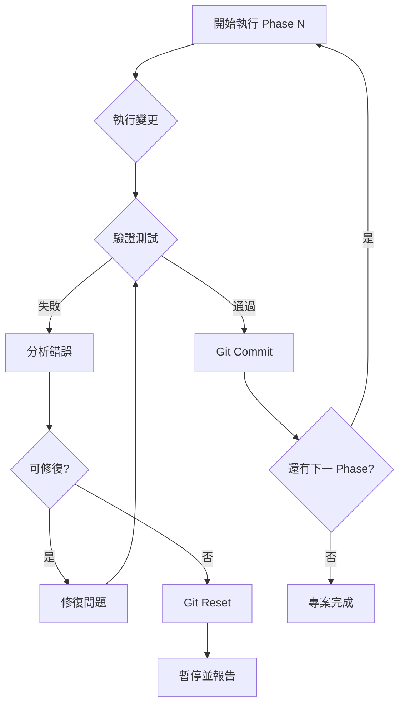

# Vare 重命名專案 - 監督計畫 (Supervision Plan)

## 目的
確保 [vare_renaming_plan.md](file:///c:/myASR_GUI/docs/vare_renaming_plan.md) 的執行過程安全、可回溯、並達成預期目標。

---

## 監督原則

### 1. 階段執行制 (Phased Execution)
- 每個 Phase 視為獨立的 Git Commit
- 執行下一 Phase 前必須驗證當前 Phase 完成
- 發現問題立即停止，不繼續推進

### 2. 驗證檢查點 (Verification Checkpoints)

| Phase | 完成後驗證項目 | 通過標準 |
|-------|----------------|----------|
| Phase 1 | `python -c "from app import VareApp"` | 無 ImportError |
| Phase 1 | 執行 `python main.py` | App 啟動成功 |
| Phase 2 | 視覺檢查標題列 | 顯示 "Vare" |
| Phase 3 | 檢查 `%APPDATA%/Vare` 存在 | 資料夾已建立 |
| Phase 3 | 舊設定遷移成功 | settings.json 內容完整 |
| Phase 5 | 切換語言後標題正確 | 中/英文皆顯示 "Vare" |

### 3. 回滾機制 (Rollback Strategy)

每個 Phase 完成後執行 Git Commit：
```bash
git add -A
git commit -m "refactor(naming): Phase X - [描述]"
```

發生錯誤時：
```bash
git reset --hard HEAD~1
```

---

## 監督流程圖



---

## 風險控制矩陣

| 風險項目 | 可能性 | 影響 | 緩解措施 |
|----------|--------|------|----------|
| Import Error 連鎖反應 | 高 | 高 | Phase 1 必須一次完成所有 import 修改 |
| 使用者設定遺失 | 中 | 高 | Phase 3 先實作遷移邏輯再改路徑 |
| 遺漏某處名稱 | 中 | 低 | 執行後全域搜尋 "Breeze" 確認無殘留 |
| 外部模型名稱誤改 | 低 | 高 | DO NOT CHANGE 清單嚴格遵守 |

---

## 執行紀錄表

| Phase | 開始時間 | 完成時間 | Commit Hash | 驗證結果 | 備註 |
|-------|----------|----------|-------------|----------|------|
| 0 | | | | | Pre-flight |
| 1 | | | | | Class Names |
| 2 | | | | | Display Strings |
| 3 | | | | | Settings Path |
| 4 | | | | | Documentation |
| 5 | | | | | Locales |

---

## 專案完成驗收標準

- [ ] `grep -r "BreezeASR" --include="*.py"` 回傳空
- [ ] `grep -r "MyASR" --include="*.py"` 回傳空
- [ ] App 標題顯示 "Vare"
- [ ] 設定檔儲存於 `%APPDATA%/Vare/`
- [ ] HuggingFace 模型名稱未被更動
- [ ] 所有 Phase 均有對應 Git Commit
